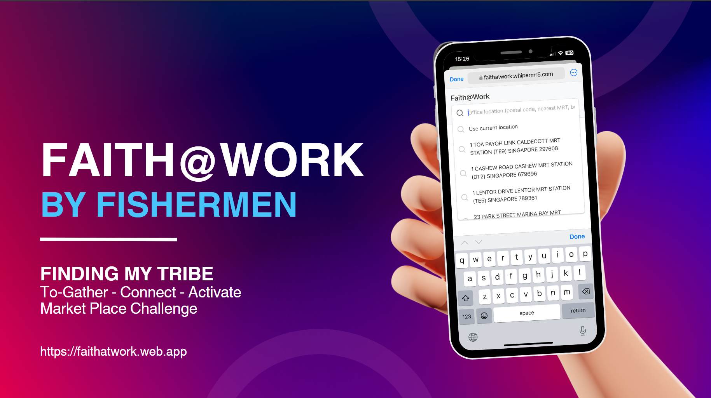

# Faith@Work
A browser-based app called Faith@Work, to connect Christians at their workplace

Developed by (from left) John Yong, Kenny Tan, Tommy Lim, Chin Wanying, Peter Tan, Bryan Sim, mentored by Roger Yeo during [#HACK2024](https://hack.indigitous.org/hack2024/)

# Introduction
This project was done as part of the #HACK2024 hackathon in October 2024 with a team of 5 hackathon participants. As part of the missional challenge to gather Christians at the workplace, over a 7-day hack, we ideated and created a browser-based app called Faith@Work, which connects Christians through activities and events near their workplace.

# Product demo
The browser-based app shows how a user can quickly find suitable discipleship or fellowship activities near their workplace.

# Product slide deck

